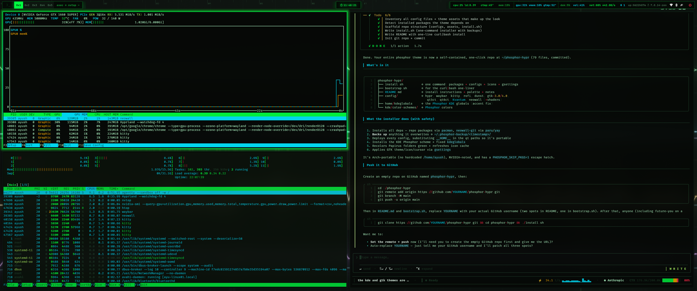
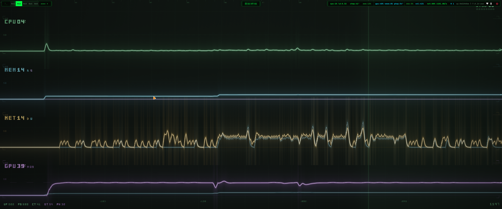

<div align="center">

# 🟢 PHOSPHOR

### A green-on-black terminal-aesthetic theme for Hyprland

Phosphor CRT vibes across your **entire** desktop — Hyprland, Waybar, Kitty,
Rofi, Dunst, GTK 3/4, Qt 5/6, KDE apps, cursors, icons, and an animated
GPU-shader wallpaper. One command. Everything themed. Nothing left blue.




</div>

---

## ⚡ One-command install

```sh
git clone https://github.com/1ay1/phosphor-hypr.git && cd phosphor-hypr && ./install.sh
```

or, straight from the web:

```sh
curl -fsSL https://raw.githubusercontent.com/1ay1/phosphor-hypr/main/bootstrap.sh | bash
```


The installer will:

1. Install every package the theme needs (repo + AUR via `paru`/`yay`)
2. **Back up** anything it's about to overwrite → `~/.phosphor-backup/<timestamp>/`
3. Copy all configs into `~/.config`
4. Install the KDE **Phosphor** color scheme + fix `kdeglobals`
5. Recolor **Papirus** folders green and refresh the icon cache
6. Apply GTK theme/icon/cursor via `gsettings`

---

## 🖥️ What's included

| Component | What it themes |
|-----------|----------------|
| `hypr/`   | Hyprland WM, hyprlock, hypridle |
| `waybar/` | Status bar (+ GPU script) |
| `kitty/`  | Terminal colors |
| `rofi/`   | App launcher (phosphor.rasi) |
| `dunst/`  | Notifications |
| `gtk-3.0/`, `gtk-4.0/` | GTK apps (Thunar, Nautilus, …) — full phosphor surfaces + green selection |
| `qt5ct/`, `qt6ct/` | Qt apps via Fusion + Phosphor color scheme |
| `Kvantum/` | Optional Kvantum theme |
| `kde/`    | KDE Plasma **Phosphor** color scheme (Dolphin, Kate, …) |
| `neowall/` | Animated GPU-shader wallpaper (matrix/synthwave/phosphor) |

Fonts: **JetBrainsMono Nerd Font** · Cursor: **Bibata-Modern-Amber** · Icons: **Papirus-Dark (green folders)**

---

## 🎨 The palette

| Role | Hex |
|------|-----|
| Background | `#050805` / `#080d09` |
| Foreground | `#b7ffcc` |
| Accent (hot green) | `#00ff41` |
| Link / hover (cyan) | `#00e5ff` |
| Border | `#173b26` |

---

## 🔧 Notes & customization

- **NVIDIA:** `hypr/hyprland.conf` sets NVIDIA env vars. On AMD/Intel, comment out
  the `LIBVA_DRIVER_NAME`, `__GLX_VENDOR_LIBRARY_NAME`, and `NVD_BACKEND` lines.
- **Qt/KDE:** after install, **log out and back in** so `QT_QPA_PLATFORMTHEME=qt6ct`
  and the color scheme apply to Qt6 apps.
- **Skip packages:** `PHOSPHOR_SKIP_PKGS=1 ./install.sh` deploys configs only.
- **Restore:** everything overwritten is in `~/.phosphor-backup/<timestamp>/`.

---

## 📦 Dependencies

Installed automatically: `hyprland hyprlock hypridle waybar dunst rofi kitty
qt5ct qt6ct kvantum papirus-icon-theme bibata-cursor-theme ttf-jetbrains-mono-nerd
ttf-nerd-fonts-symbols wl-clipboard cliphist polkit-gnome` · AUR: `neowall-git`

---

<div align="center"><sub>Take the red pill. 🔴 → 🟢</sub></div>
